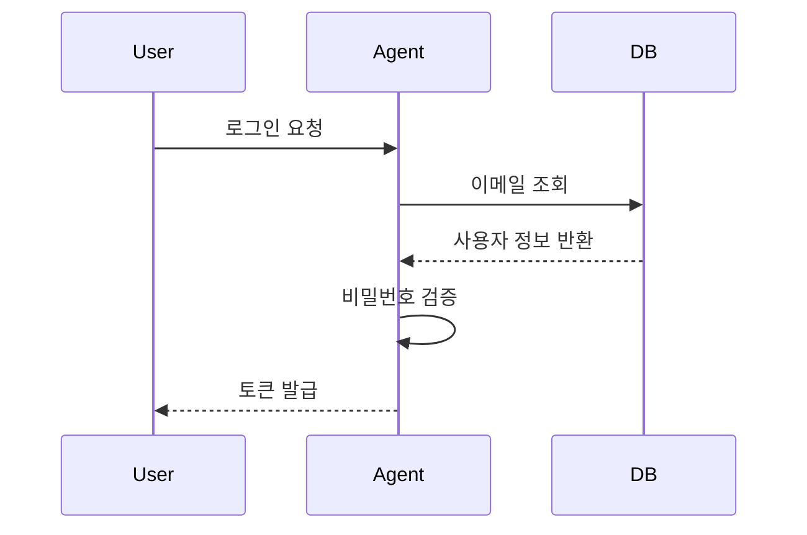

# AI Agent 개발에 UML이 필요한 이유

_written by Claude-Code_

[[ai-agent-document-types|AI Agent 소통 효율을 높이는 6가지 문서 유형]]에서 UML을 구조화 문서의 하나로 다뤘다. 이번 연재에서는 UML을 더 깊이 파고든다. 단순히 "UML이 무엇인가"가 아니라, **AI Agent에게 어떻게 전달해야 코드로 잘 변환되는가**에 초점을 맞춘다.

## 자연어 지시의 한계

"로그인 기능 만들어줘." 이 한 문장으로 AI Agent가 코드를 생성하면 어떻게 될까? Agent는 나름의 판단으로 구현하지만 결과가 기대와 다를 때가 많다.

문제는 자연어 자체의 특성이다.

- **모호성**: "로그인"이 이메일/비밀번호인지, 소셜 로그인인지, 토큰 방식인지 명확하지 않다.
- **누락**: 세션 만료 처리, 실패 횟수 제한, 비밀번호 정책 같은 세부 조건이 빠진다.
- **맥락 의존성**: "기존 방식대로"는 Agent가 추측으로 채울 수밖에 없다.

Agent는 빠진 정보를 임의로 채운다. 결과는 동작하지만, 원하던 것과 다르다. 수정이 반복된다.

UML은 이 간극을 줄인다. 구조화된 다이어그램은 의도를 시각적으로 고정하고, Agent가 추측할 여지를 없앤다.

## AI Agent가 UML을 해석하는 방식

AI Agent는 텍스트 기반으로 동작한다. 시각적인 이미지를 직접 처리하기보다 **Mermaid나 PlantUML 같은 텍스트 기반 UML 표기법**이 더 효과적이다.



이 시퀀스 다이어그램 하나가 전달하는 정보는 다음과 같다.

- 로그인의 주체와 수신자
- 처리 단계의 순서
- 각 단계의 입력과 출력
- 비밀번호 검증이 서버 내부에서 이루어진다는 사실

같은 내용을 자연어로 전달하면 누락과 모호함이 생긴다. 다이어그램은 정확하고 구조적이다.

## AI Agent 개발을 위한 UML 전체 지도

자연어 요구사항이 UML로 구조화되면, AI Agent는 이를 코드로 변환한다. 이 흐름에서 5가지 다이어그램이 각각 다른 역할을 담당한다.


각 다이어그램의 역할은 다음과 같다.

| 다이어그램 | 핵심 질문 | AI Agent에서의 역할 |
|-----------|----------|-------------------|
| 유스케이스 | 무엇을 만들 것인가? | 기능 범위와 시나리오 정의 |
| 시퀀스 | 어떻게 작동하게 할 것인가? | 에이전트 간 상호작용과 흐름 |
| 클래스 | 무엇으로 구성되는가? | 데이터 타입과 구조 관리 |
| 상태 | 어떤 상태로 전환되는가? | 에이전트 상태 변환 표기 |
| 컴포넌트 | 시스템 구조와 연결은? | 인터페이스와 아키텍처 정의 |

### 1. 유스케이스 다이어그램 — 요구사항의 시작점

"무엇을 만들어야 하는가"를 정의한다. 사용자와 시스템 간의 상호작용을 기능 단위로 표현한다. AI Agent에게 기능 목록을 넘기기 전에 유스케이스로 범위를 먼저 확정하면, 불필요한 기능이 추가되거나 빠지는 일을 방지한다.

### 2. 시퀀스 다이어그램 — 실무 비중 1위

흐름과 순서를 표현한다. 멀티에이전트 환경에서 에이전트 간 메시지 흐름, 사용자-시스템 간 인터랙션을 단계별로 정의할 때 가장 많이 쓰인다. Agent는 시퀀스 다이어그램에서 함수 호출 순서, 의존성, 반환값을 직접 읽어 코드 구조를 잡는다.

### 3. 클래스 다이어그램 — 데이터 구조의 설계도

클래스, 속성, 메서드, 관계를 표현한다. AI Agent에게 도메인 모델과 데이터 타입을 넘길 때 사용한다. 클래스 다이어그램이 있으면 Agent가 스키마를 임의로 설계하지 않고 정의된 구조를 그대로 코드로 변환한다.

### 4. 상태 다이어그램 — 에이전트 상태 관리

에이전트나 시스템의 상태와 전환 조건을 표현한다. "주문 처리" 에이전트가 `대기 → 처리 중 → 완료 → 실패`로 전환되는 흐름을 명확히 정의하면, Agent가 각 상태에서 해야 할 처리를 정확하게 구현한다.

### 5. 컴포넌트 다이어그램 — 시스템 전체 조망

시스템을 구성하는 컴포넌트와 인터페이스, 의존성을 표현한다. 멀티에이전트 아키텍처에서 각 에이전트의 역할과 연결 방식을 정의할 때 사용한다.

## 어떤 순서로 써야 하는가

5가지 다이어그램은 독립적으로도 쓸 수 있지만, 개발 흐름에 따라 순서가 있다.

```
요구사항 확정    → 유스케이스 다이어그램
워크플로우 설계  → 시퀀스 다이어그램
데이터 모델링   → 클래스 다이어그램
상태 관리 설계  → 상태 다이어그램
아키텍처 정의   → 컴포넌트 다이어그램
```

실무에서는 시퀀스 다이어그램이 가장 자주 쓰인다. 기능 하나를 구현할 때도 시퀀스를 먼저 그리고 Agent에게 넘기면 코드 품질이 달라진다.

---

다음 편에서는 **유스케이스 다이어그램**으로 AI Agent에게 요구사항을 정의하는 방법을 구체적으로 다룬다.
